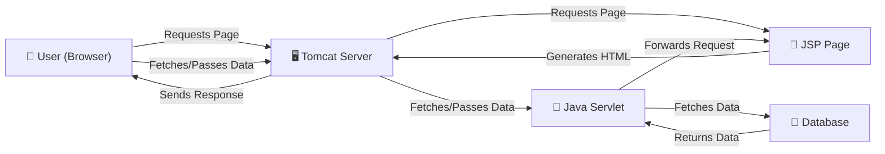

```mermaid
graph LR;
    User["🧑 User (Browser)"] -->|Requests Page| Tomcat["🖥️ Tomcat Server"];
    Tomcat -->|Requests Page| JSP["📄 JSP Page"];
    JSP -->|Generates HTML| Tomcat;
    
    Tomcat -->|Fetches/Passes Data| Servlet["🚀 Java Servlet"];
    Servlet -->|Forwards Request| JSP;

    Servlet -->|Fetches Data| Database["💾 Database"];
    Database -->|Returns Data| Servlet;
    
    Tomcat -->|Sends Response| User;
    User -->|Fetches/Passes Data| Tomcat;

```